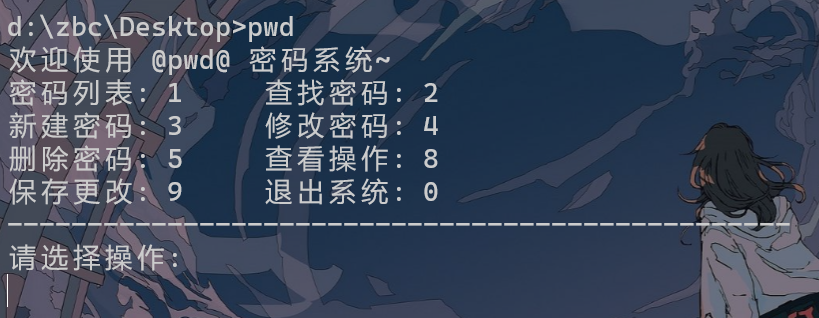
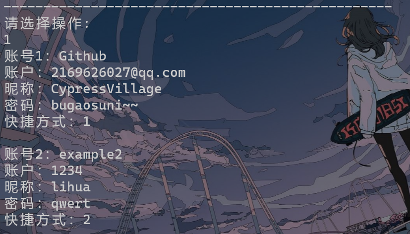
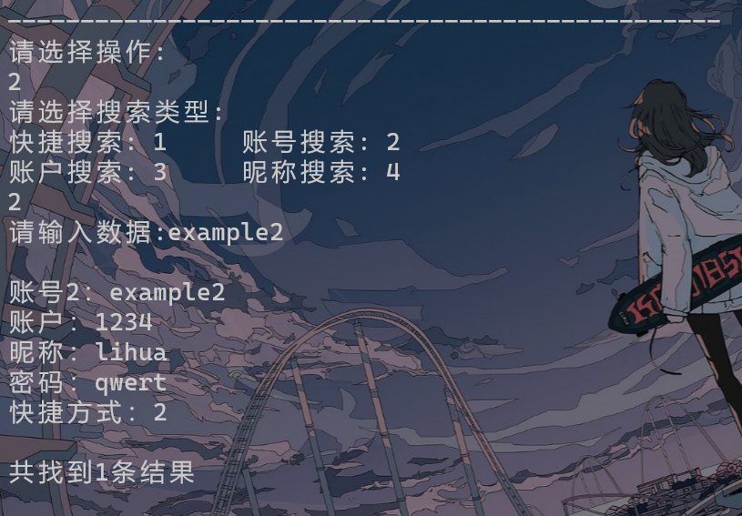
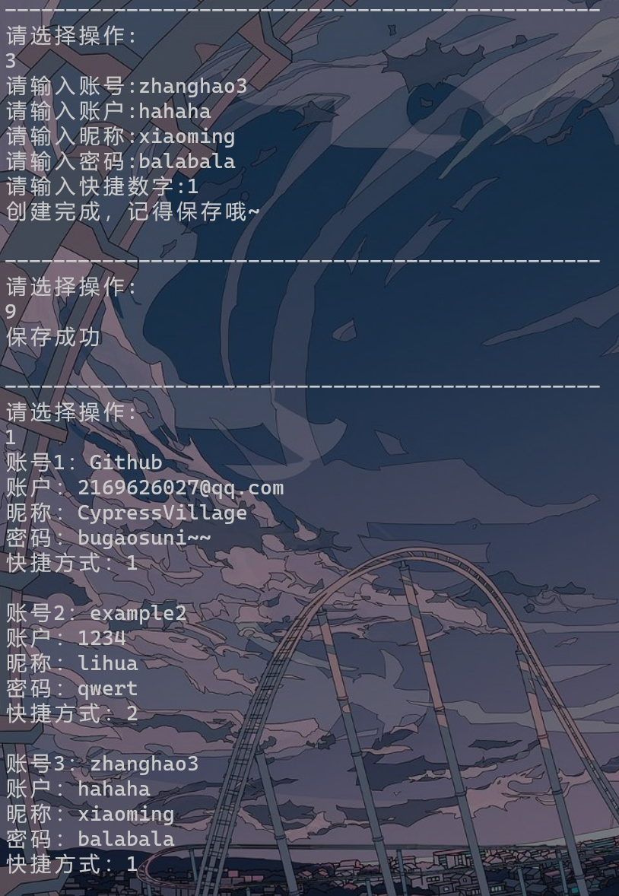
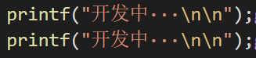

## 简介

​		不知道你日常保存密码的方式是什么呢？是脑力超强全凭记忆？还是把它们记到一个特定的地方？我属于后者，然鹅一直没有找到很好的地方，之前都一直用Excel，有不方便（要一层层点开文件夹，放桌面上又太显眼），打开慢等缺点，我寻思记个密码也不需要什么高级功能，既然没有软件满足需求，那我就自己来一个。于是， 写了一个300多行的密码管理器，名字是pwd，取名“password”的简写，也是为了输命令时方便。希望对你有所帮助。

---
## 更新日志

### 2002.2.14
- 增加文件选择功能
### 2022.2.17
- 更改整体架构！现在main函数变得简洁了
- 添加多文件支持，用户现在可以创建多个密码本
- 默认编码为UTF-8了，用户无需自行设置更改
### 2022.2.19
- 添加文件列表，文件删除功能

---

## 使用说明

- 这是一个简单的密码管理程序，每条密码分为5个部分，按行存储，实例如下：

  > GitHub
  >
  > 2169626027@qq.com
  >
  > CypressVillage
  >
  > bugaosuni~~
  >
  > 1

- 该程序可以实现简单的密码储存，查找，更改等工作

- 操作界面：（windows terminal下）背景图片是windows terminal实现的，与程序无瓜

  

  

  

  
  
  - ~~因为本人太菜。。。怎么也搞不好delete的部分，就，就，就删掉了delete的功能（逃），delete功能改为把账号名更换为“todelete”。。。想真正实现删除有以下3种方案：~~
    1. ~~鼓励作者好好学习掌握更多知识并催更作者（成功率0.01%）~~
    2. ~~就这就这？这么简单的操作作者竟然写不出来？直接对线作者，告诉作者怎么改代码！作者会感谢你的！~~
    3. ~~自己动手，丰衣足食！点开自己存密码的文件手动删除（写程序的意义在哪里。。。不过删除的场景应该不多，这程序凑活着也能用）~~
  - **删除功能正式上线啦！**

---

## 注意事项（必读）：

- ~~**请事先在程序所在文件夹下创建一个名为`pwd_data.txt`的文件**，用于储存密码信息。所有密码储存在`pwd_data.txt`中！（由于添加密码本功能，该项已移除~~ 程序只是用“值传递”的方式运行，记得保存！记得保存！记得保存！（按9保存）
- ~~默认各信息最大长度为30字节，lnk（快捷方式）是2字节, 可以根据需求自行更改（lnk现在可以是字符串了）~~
- 除了第一项账号其他的信息允许重复（账号也没有重复的可能吧），查找时会列出所有满足条件的密码
- 因为C语言要实现将汉字读入文件比较麻烦（其实就是自己菜），本程序不支持输入汉字，如果输入在文件里会是空白。（但是在文本文档里以正确编码输入汉字是可以读取的，另外记事本的默认编码是UTF-8）
- 我的日常使用场景是**将程序加入环境变量，配合`windows terminal`右键在cmd中打开**（极其舒适），~~所以编码默认为GB 2312，若需要UTF-8可自行更改（默认编码UTF-8了）~~
- 因为会在cmd不同路径中打开文件，所以我自己的程序里`pwd_data.txt`用的是绝对路径，所以，**你直接编译出来的程序是一定会报错的**!可以自行更改路径。（现在仍需更改文件夹路径）
- ~~程序里有一个`system("pause");`我给注掉了，加上它的原因是使用cmd直接双击打开程序运行时，程序结束就不会有提示（有点强迫症），但是这个功能对于我没什么用，可自行修改（现在关闭直接刷新页面了）~~
- 已知问题：更改密码时如果第一次输入错误，第二次输入时将会产生bug（待解决）
---

## 短期咕咕咕计划：

- ~~搞定删除功能~~
- ~~添加多文件操作，可设置多个“密码本”~~
- 添加二级密码功能
- 添加更改快捷方式名称功能
- ~~完成密码本列表，密码本删除~~，密码本更名功能
- ~~新建密码本功能（写完才想起来）~~
- 中英文切换功能，外观自定义功能，具体想法是添加config.h文件

---

## others

### 致19岁的自己：

> 这是我给自己的19岁生日礼物~但是不得不说时间真的好紧张，大学生活真的好忙……
>
> 也是我写的第一个可以称得上是一个小项目的东东了，过程确实历尽艰辛，为了解决怎么读取文件这件事花了两天……还有不知道结构体定义到底放在哪个文件里怎么编译也过不了……不会给定义好的字符数组赋值……以及不知道char*和char(\*）[30]的区别……不过正因为好多不懂，所以我收获了好多！冲鸭~
>

***“要把所有的夜归还给星河，把所有的春光归还给疏疏篱落，把所有的慵慵沉迷与不前，归还给过去的我。明日之我，胸中有丘壑，立马振山河。”***

### 小小花絮：

曾经一度以为自己肝不动了~~

咨询软件发布者，懂了……等等？？？

